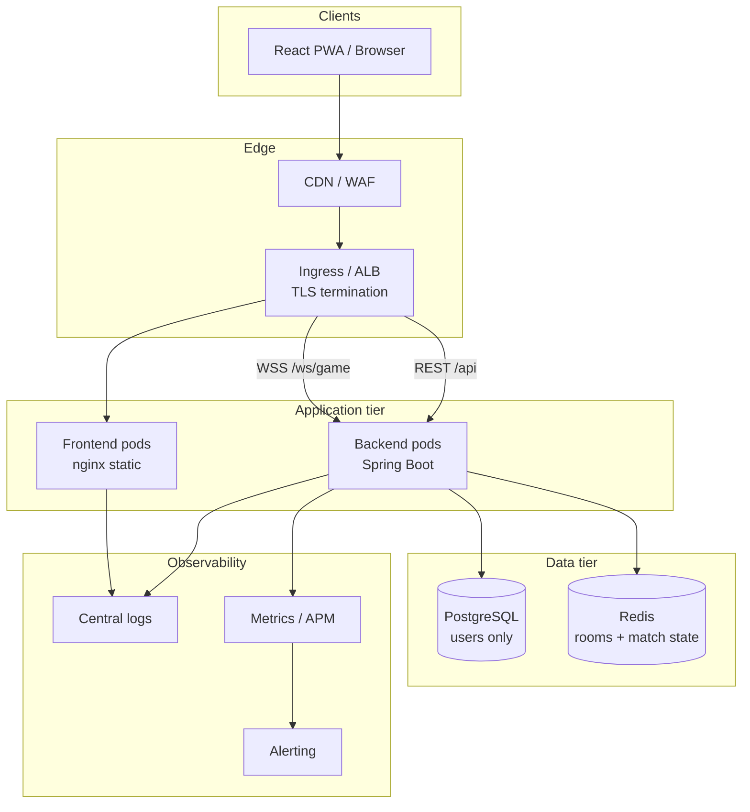

# Infrastructure Architecture

## System context

MyOwnLeague is a real-time hand-cricket game: REST for auth/matchmaking, **STOMP over WebSocket** for live play, **PostgreSQL** for users, **Redis** for ephemeral match/room state.



## Network zones

| Zone | Components | Exposure |
|------|------------|----------|
| Public | CDN, ingress, frontend | Internet |
| Private | Backend, PostgreSQL, Redis | VPC only; no public IPs on data stores |
| Management | CI runners, bastion (optional) | Restricted CIDR / SSO |

## Production topology (recommended)

### Phase 1 — Single region, HA data (target for launch)

```
                    ┌─────────────────┐
                    │  Route 53 / DNS │
                    └────────┬────────┘
                             │
              ┌──────────────┴──────────────┐
              │                             │
       app.example.com              api.example.com
              │                             │
       ┌──────▼──────┐               ┌──────▼──────┐
       │ CloudFront  │               │ ALB/Ingress │
       │  → S3/FE    │               │  → API x1   │
       └─────────────┘               └──────┬──────┘
                                            │
                         ┌──────────────────┼──────────────────┐
                         │                  │                  │
                    ┌────▼────┐       ┌─────▼─────┐      ┌─────▼─────┐
                    │ RDS PG  │       │ ElastiCache│      │ Secrets   │
                    │ Multi-AZ│       │ Redis repl.│      │ Manager   │
                    └─────────┘       └────────────┘      └───────────┘
```

- **1 API replica** until Redis STOMP relay is implemented.
- Ingress: **session affinity** for `/ws/**` if you add replicas early.
- Frontend: immutable static assets; long cache on hashed files, short on `index.html`.

### Phase 2 — Horizontal API + sticky WS

- API Deployment `replicas: 2+` with **pod anti-affinity**.
- Ingress cookie affinity OR Redis message broker for `/topic`.
- Redis: primary + replica; enable persistence only if you rely on Redis for recovery beyond TTL keys (current design: ephemeral OK with AOF optional).

### Phase 3 — Multi-region (optional)

- Active-passive: DNS failover, read replica in secondary region.
- Game sessions are short — cross-region active-active is usually unnecessary until global player base.

## Data flow

| Path | Protocol | Notes |
|------|----------|-------|
| Login/register | HTTPS REST | JWT returned; store in memory/localStorage per frontend policy |
| Create/join room | HTTPS REST | Writes `mol:room:*` in Redis |
| Live match | WSS STOMP | JWT in connect headers; topics `/topic/match/{id}` |
| Health | HTTP GET `/actuator/health` | Liveness/readiness for orchestrator |

## Reliability design

| Risk | Mitigation |
|------|------------|
| API pod crash mid-match | Redis retains state; client reconnects STOMP; implement resume window (phase1 roadmap) |
| Redis loss | Use managed Redis with replication; TTL keys limit blast radius |
| DB outage | Auth/register down; in-flight matches can continue until Redis TTL expires |
| Deploy during traffic | Rolling update + `maxUnavailable: 0` + readiness probe; schedule off-peak |
| DDoS / brute force room codes | WAF rate limits + app-level rate limiting |
| Secret leak | Secrets Manager rotation; separate JWT signing keys per env |

## Scaling levers

| Component | Scale trigger | Action |
|-----------|---------------|--------|
| Frontend | CPU low, bandwidth high | CDN cache hit ratio; more edge POPs |
| API REST | p95 latency, CPU | Replicas after broker fix; HPA on CPU |
| API WS | Connection count | Dedicated WS nodes or broker |
| Redis | Memory, ops/sec | Larger node / cluster mode for key volume |
| PostgreSQL | Connection pool saturation | RDS scale-up; PgBouncer sidecar |

## Security architecture

- TLS 1.2+ everywhere; HSTS on frontend.
- JWT: short-lived access tokens; rotate `JWT_SECRET` with planned logout.
- PostgreSQL/Redis: private subnets, security groups, encryption at rest.
- No `ddl-auto=update` in prod — Flyway/Liquibase only.
- CORS: explicit origins (no `*` in prod).
- Container: non-root user, read-only root FS where possible, distroless or alpine-hardened images.

## Disaster recovery

| Scenario | RPO | RTO | Procedure |
|----------|-----|-----|-----------|
| AZ failure | 0–5 min (RDS) | 15–30 min | Failover Multi-AZ RDS; redeploy API in healthy AZ |
| Region loss | 24h (snapshot) | 2–4 h | Restore PG snapshot; promote Redis replica; DNS cutover |
| Bad deploy | 0 | 5 min | `kubectl rollout undo` or re-deploy previous image tag |

Backup: automated RDS snapshots (7–35 days), test restore quarterly.
