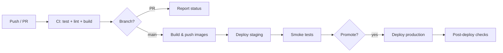

# Deployment Workflow

## Branching model (GitHub Flow)

```
main          ─── always deployable; protected
  ↑
feature/*     ─── PR → CI → review → merge
release/*     ─── optional; tag for prod promotion
```

| Branch | Deploys to | Approval |
|--------|------------|----------|
| `main` | Staging (auto) | CI green + 1 review |
| Tag `v*.*.*` | Production | Manual workflow dispatch or environment gate |
| `hotfix/*` | Prod via fast-track | Owner approval |

## Pipeline stages



### CI (every PR and push to `main`)

1. **Backend**: `./mvnw -B verify` (unit + integration tests)
2. **Frontend**: `npm ci && npm run lint && npm run build`
3. **Optional**: Trivy scan on Dockerfiles (on `main` only)

### CD (on merge to `main`)

1. Build `mol-backend` and `mol-frontend` Docker images.
2. Tag: `sha-<short>`, `main-<run_number>`, and semver on release tags.
3. Push to container registry (GHCR/ECR/GCR).
4. Deploy to **staging** services (Render backend + Cloudflare Pages frontend).
5. Run smoke: `GET /actuator/health`, auth health, static frontend 200.

### Production promotion

- Trigger: GitHub **environment** `production` with required reviewers.
- Input: image digest or tag (immutable — never deploy `latest` alone).
- Strategy: Render rolling deploy for backend + Cloudflare Pages immutable frontend deployments.

## Release process

1. Freeze: no unrelated merges during release window.
2. Create release branch or tag `v1.2.3` from `main`.
3. Run DB migrations (Flyway) **before** backend starts taking production traffic.
4. Deploy backend → wait healthy → deploy frontend (API URL baked at build).
5. Monitor error rate and WS connect success for 30 minutes.
6. Document release in changelog; archive staging tag.

## Rollback

| Symptom | Action |
|---------|--------|
| 5xx spike after deploy | Trigger rollback to previous Render deploy and previous Cloudflare Pages build |
| Migration failure | Stop deploy; restore DB from snapshot if forward migration partial |
| WS broken | Check Render service settings/timeouts and revert to last known good deploy |

Keep **previous image digest** in deployment annotations for one-click rollback.

## Configuration management

| Config | Where |
|--------|-------|
| Non-secret app config | Render and Cloudflare Pages environment settings |
| Secrets | Render secret environment variables / managed secret stores |
| Frontend API URLs | CI build-args at image build time per environment |

## Downtime minimization

- Backend health checks must pass before traffic is served.
- Deploy during low-traffic windows and monitor websocket reconnect behavior.
- Database migrations: backward-compatible expand/contract pattern.

## Smoke test script (post-deploy)

```bash
API=https://api.staging.example
curl -sf "$API/actuator/health" | jq -e '.status == "UP"'
curl -sf -o /dev/null -w "%{http_code}" "$API/api/v1/auth/login" -X POST \
  -H "Content-Type: application/json" -d '{"username":"x","password":"y"}' 
# expect 401/400, not 502/503
```

Frontend: load `/`, verify `index.html` and main JS bundle 200.
